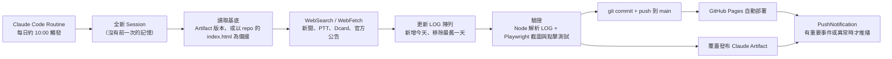

# mrt-log · 北捷輿情日誌

每天自動彙整「台北捷運」相關新聞與社群討論，整理成可切換日期、可兩日比對的單頁網站。

- **線上網址（GitHub Pages）**：<https://cjw9223233.github.io/mrt-log/>
- **更新頻率**：每日一次，約台灣時間 10:00（由 Claude Code 排程任務自動執行）
- **收錄範圍**：最近 14 天（滑動視窗；更早的資料保存在 git 歷史中）
- **新手導讀**：[`docs/control-room.html`](docs/control-room.html)：用「捷運路網」圖解整條自動化流程，適合不寫程式的人

> 本站內容為公開輿論的摘錄，不是官方公告。營運資訊請以臺北捷運公司公告為準。

---

## 依你的角色，從這裡開始讀

| 你是… | 你想知道… | 先讀 |
|---|---|---|
| 讀者／主管 | 這是什麼、怎麼看 | [1. 這是什麼](#1-這是什麼) → [2. 如何使用網頁](#2-如何使用網頁) |
| PM／營運 | 它怎麼自己跑、出事怎麼辦 | [3. 系統架構](#3-系統架構) → [7. 疑難排解](#7-疑難排解) |
| 維護者／工程師 | 資料格式、怎麼安全地改 | [4. 專案結構](#4-專案結構) → [5. 資料模型](#5-資料模型) → [6. 維護手冊](#6-維護手冊) |

---

## 1. 這是什麼

### 要解決的問題
捷運相關輿情散在新聞網站、PTT MRT 板、Dcard、社群貼文與官方公告之間。單看一天的新聞，看不出哪些議題「還在燒」、哪些已經退燒、官方承諾有沒有兌現。

### 產品做什麼
- **每日一頁快照**：當天總結、3 個關鍵指標、依五大分類整理的條目，每則都附原始來源連結。
- **議題追蹤表**：固定追蹤 8 到 12 個長期議題，用格點顯示它們在 14 天內哪幾天出現、哪幾天有爭議。
- **兩日比對**：任選兩天，列出「新出現／持續／已退燒」的議題。
- **原始資料**：頁面底部可展開並複製完整 JSON，方便備份或做其他分析。

### 不做什麼（範圍界線）
- 不是即時警報系統。一天只更新一次。
- 不做情緒分析模型或量化評分。「熱度」與「爭議」是彙整時的人工判斷式標記。
- 沒有後端、資料庫或帳號系統。整個網站就是一個靜態 HTML 檔。

---

## 2. 如何使用網頁

| 區塊 | 位置 | 用法 |
|---|---|---|
| 日期清單 | 左欄上方 | 點日期切換。紅點代表該日有「爭議」條目，右側數字是條目數 |
| 比對兩個日期 | 日期清單下方 | 勾選後再點另一個日期當對照組，再點一次可取消 |
| 議題追蹤 | 左欄下方 | 灰點表示未出現，有色點表示出現，紅點表示出現且有爭議。滑鼠移上去可看則數 |
| 當日總結 | 主欄頂端 | 第一句是標題，下方附 3 個指標，例如當日則數、爭議題數、當日風向 |
| 分類條目 | 主欄 | 依「營運／工程與路網／票價與票務／安全與治安／社群熱議」分組。比對模式下，新出現的議題會標上「新增」 |
| 延續中的背景議題 | 主欄下方 | 跨多日的主線脈絡說明 |
| 原始資料（JSON） | 最底部 | 展開後按「複製全部」 |

頁面支援手機版面與深色模式（跟隨系統設定）。

---

## 3. 系統架構

### 3.1 全貌



### 3.2 元件與責任

| 元件 | 位置 | 責任 | 存在 repo 內？ |
|---|---|---|---|
| 排程任務（Routine）與任務指令 | Claude Code 後台（claude.ai/code） | 定時觸發，並定義蒐集範圍、寫作規則、部署步驟 | **否** |
| `index.html` | repo 根目錄 | 呈現層與資料層合一：CSS、LOG 資料、渲染 JS 全在這一個檔案 | 是 |
| Claude Artifact | claude.ai | 第二個發布點，提供免技術背景也能開的分享連結；同時是排程讀取基底的首選來源 | **否** |
| GitHub Pages | `cjw9223233.github.io/mrt-log` | 從 `main` 根目錄直接發布靜態網站 | 設定在 GitHub repo Settings |
| `.nojekyll` | repo 根目錄 | 讓 GitHub Pages 跳過 Jekyll 處理，原樣發布檔案 | 是 |
| `docs/control-room.html` | `docs/` | 給非技術人員看的流程教學 | 是 |

> ⚠️ **維護者須知**：這個系統最關鍵的「邏輯」是排程任務的**指令文字**，它不在 repo 裡。要改蒐集來源、寫作風格、保留天數或推播規則，都得到 Claude Code 的排程設定裡改，而不是改這個 repo。請把指令的最新版本另外備份，建議之後也收進 repo，例如 `ops/routine-prompt.md`。

### 3.3 關鍵設計決策

| 決策 | 理由 | 代價 |
|---|---|---|
| 資料直接寫在 HTML 裡（LOG 陣列），沒有資料庫 | 零基礎設施、零費用；AI 每次只要讀寫一個檔案；git 歷史本身就是完整的版本紀錄 | 檔案會隨內容變大（目前約 125 KB）；不適合多人同時編輯 |
| 每次執行都從檔案接手，不依賴 AI 記憶 | 排程每次都開全新 Session，狀態只能存在檔案裡 | 基底若讀錯版本，就可能覆蓋掉較新的內容 |
| 同一天重跑時「就地補充」，不新增一筆 | 維持 `date` 唯一，避免日期清單重複 | 排程邏輯必須先檢查當天資料是否已存在 |
| 14 天滑動視窗 | 控制頁面大小與追蹤表寬度 | 舊資料只能從 git 歷史找回（見 [6.5](#65-查詢超過-14-天的歷史資料)） |
| 雙軌發布（Artifact + GitHub Pages） | Artifact 方便分享；Pages 是自己可控的公開網站，之後可接自訂網域 | 兩邊可能不同步，詳見[疑難排解](#7-疑難排解) |
| 預設不推播 | 平靜的日子不打擾人 | 沒收到通知不代表有跑。要確認請看頁首的「最後更新」 |

---

## 4. 專案結構

```
mrt-log/
├── index.html              # 整個網站：樣式 + 資料（LOG）+ 渲染程式
├── docs/
│   └── control-room.html   # 非技術人員導讀：自動化流程圖解
├── .nojekyll               # 關閉 GitHub Pages 的 Jekyll 處理
└── README.md
```

`index.html` 內部分區（由上到下）：

| 區段 | 定位方式 | 說明 |
|---|---|---|
| `<style>` | 檔案開頭 | 顏色 token 定義在 `:root`，深色模式覆寫在 `prefers-color-scheme: dark` 與 `[data-theme="dark"]` |
| HTML 骨架 | `<header class="masthead">` | 頁首的「最後更新」時間戳**寫死在這裡**，每次更新都要改 |
| 背景議題 | `<section class="bg-note">` | 手寫的長期議題脈絡，**不在 LOG 裡**，需隨情勢更新 |
| `CATS`、`KIND` | `<script>` 開頭 | 分類與來源類型的對照表 |
| **LOG 資料** | `DATA:START` 註解到 `/* === DATA:END === */` | 唯一的資料來源，欄位規格寫在 `DATA:START` 註解內 |
| `TRACK` | 緊接在 `DATA:END` 之後 | 議題追蹤表要列出的標籤 |
| 渲染函式 | `renderDays` / `renderTracker` / `render` … | 純前端渲染，不依賴任何框架 |

---

## 5. 資料模型

`LOG` 是一個陣列，**新的日期放在最前面**，每個元素代表一天：

```js
{
  date: "2026-10-05",        // 唯一鍵，YYYY-MM-DD
  wd: "週一",
  summary: "第一句會被抽出當標題。後面是完整總結……",  // 第一句務必以「。」結尾
  metrics: [["當日則數","6"],["爭議題","0"],["當日風向","中性"]],  // 最多 3 組
  items: [
    {
      cat:  "safe",          // ops | build | fare | safe | buzz
      kind: "news",          // news | forum | social
      hot:  false,           // true 表示當日有明顯爭議，會標紅
      tags: ["車廂治安","持刀通報"],  // 議題追蹤與兩日比對靠這個串起來
      t:    "標題",
      p:    "內文摘要",
      src:  "來源名稱（日期）",
      url:  "https://..."    // 必須是可點擊的原始連結
    }
  ]
}
```

**分類對照（`CATS`）**

| key | 名稱 | key | 名稱 |
|---|---|---|---|
| `ops` | 營運狀況 | `safe` | 安全與治安 |
| `build` | 工程與路網 | `buzz` | 社群熱議 |
| `fare` | 票價與票務 | | |

**資料規則（不變式）**

1. `date` 唯一，且整個陣列依日期由新到舊排列。
2. 最多保留 14 天。新增一天時，要同時移除最舊的一天。
3. `tags` 要**沿用既有的標籤文字**，一字不差，議題追蹤與比對才連得起來。
4. 新標籤若要出現在追蹤表，需同步加進 `TRACK`。`TRACK` 建議維持 8 到 12 個，依重要性排序。
5. 每則 `url` 都必須是真實來源，不可憑印象生成內容。

---

## 6. 維護手冊

### 6.1 本機預覽
不需要安裝任何東西，直接用瀏覽器開啟 `index.html` 即可。若要模擬線上環境：

```bash
python -m http.server 8000   # 然後開 http://localhost:8000
```

### 6.2 修改前後的驗證
改完 LOG 後，執行以下指令確認格式沒有壞（需要 Node.js）：

```bash
node -e '
const fs=require("fs");const h=fs.readFileSync("index.html","utf8");
const src=h.slice(h.indexOf("const LOG ="),h.indexOf("/* === DATA:END === */"));
const LOG=new Function(src+";return LOG")();
const dates=LOG.map(d=>d.date);
const ok=dates.every((d,i)=>i==0||d<dates[i-1])&&new Set(dates).size==dates.length;
const bad=LOG.flatMap(d=>d.items.filter(i=>!["ops","build","fare","safe","buzz"].includes(i.cat)||!["news","forum","social"].includes(i.kind)||!/^https?:\/\//.test(i.url||"")).map(i=>d.date+" "+i.t));
console.log(LOG.length+" 天 / "+LOG.reduce((n,d)=>n+d.items.length,0)+" 則；日期遞減且唯一："+ok+"；欄位異常："+bad.length);
'
```

預期輸出類似 `14 天 / 92 則；日期遞減且唯一：true；欄位異常：0`。之後再用瀏覽器開頁面，點幾個日期並試一次「比對兩個日期」，確認畫面正常。

### 6.3 常見維護任務

| 任務 | 怎麼做 | 注意 |
|---|---|---|
| 修正某則錯字或錯誤連結 | 直接改 `index.html` 中 LOG 的對應欄位，然後 commit 並 push | 排程下次會以**最新基底**接手。若基底取自 Artifact，手動改動可能被覆蓋，請同步請 Claude 更新 Artifact，或在排程指令中註明 |
| 新增追蹤議題 | 在 `TRACK` 加入標籤，並確保 LOG 中已有條目使用**完全相同**的標籤 | 太多欄會讓追蹤表難讀，請移除已退燒的議題 |
| 更新背景議題 | 編輯 `<section class="bg-note">` 內的 `<li>` | 這段不在 LOG 裡，排程會一起維護 |
| 新增分類 | 在 `CATS` 加 key、名稱與顏色變數，並在 `:root` 與兩組深色模式區塊都補上 `--c-xxx` | 同時更新排程指令，AI 才會使用新分類 |
| 調整保留天數、蒐集來源或寫作風格 | 修改**排程任務指令**（不在 repo） | 改完後手動觸發一次，確認結果 |
| 改版面或樣式 | 修改 `<style>` 與渲染函式 | 排程只會動資料與時間戳，不會動版面；改完要在淺色、深色模式與手機寬度各看一次 |

### 6.4 Commit 慣例
- 排程自動提交的訊息格式為 `日誌更新 YYYY-MM-DD`，作者是 `Claude`，trailer 會附上 `Claude-Session` 連結，可回頭查看當次執行過程。
- 人工修改請用可辨識的訊息，例如 `修正：2026-10-03 文湖線條目連結`，方便和自動提交區分。

### 6.5 查詢超過 14 天的歷史資料
每個自動提交都是當天的完整快照：

```bash
git log --oneline -- index.html                  # 找出目標日期的 commit
git show <commit>:index.html > snapshot.html     # 取出當時的頁面，直接用瀏覽器開
```

---

## 7. 疑難排解

| 症狀 | 可能原因 | 處置 |
|---|---|---|
| 網站「最後更新」停在昨天以前 | 排程沒觸發、執行失敗，或 push 被拒 | 到 claude.ai/code 檢查排程的執行紀錄；用 `git log` 看最近一次提交 |
| repo 已更新，網站卻沒變 | GitHub Pages 部署中或有快取 | 等幾分鐘後強制重新整理；到 repo 的 Actions／Pages 頁面看部署狀態 |
| push 被拒（main 受保護） | 分支保護規則 | 排程會改推到備用分支並通知；可調整保護規則，或把 Pages 來源切到該分支 |
| 「repo 尚未授權」錯誤 | 排程的 GitHub 權限沒包含此 repo | 到排程設定把 `cjw9223233/mrt-log` 加入允許清單 |
| Artifact 與 GitHub 內容不一致 | 某一邊發布失敗，或基底讀到舊版 | 以時間戳較新、內容較完整的一方為準，請 Claude 依此重新發布兩邊 |
| 某天內容寫著官方頁面「無法讀取」 | 執行環境的對外連線代理擋下部分網域（例如 metro.taipei） | 屬於預期行為，系統會改用搜尋摘要間接取得資訊 |
| 頁面空白 | LOG 語法錯誤（少逗號或引號），導致整段 JS 失效 | 用 [6.2](#62-修改前後的驗證) 的指令定位；或 `git revert` 回上一版 |

---

## 8. 已知限制與後續建議

- **核心邏輯不在版控內**：排程指令與 Artifact 網址都不在 repo，換人維護時最容易斷線。建議把指令收進 `ops/routine-prompt.md`，並在本文件補上 Artifact 連結。
- **沒有 CI 驗證**：目前驗證只在排程執行時進行。可以把 [6.2](#62-修改前後的驗證) 的檢查做成 GitHub Actions，在每次 push 時自動執行。
- **資料與呈現耦合**：LOG 寫在 HTML 裡，對 AI 很方便，但不利於其他程式取用。若之後有分析需求，可以拆出 `data/log.json`，讓頁面用 `fetch` 載入。
- **背景議題與時間戳是手寫的**：它們不在 LOG 裡，容易忘記更新。
- **內容品質依賴 AI 判斷**：「爭議」與「當日風向」屬於主觀標記，建議定期抽查來源連結與摘要是否正確。
